## This version of README is for F5 UDF lab (NGINX Workshop Sandpit blueprint), as the commands used are slighlty different.

## Credit
This repo leveraged the work done by fantastic [Fabrizio](https://github.com/fabriziofiorucci) at https://github.com/nginxinc/NGINX-Demos/tree/master/nginx-nms-docker

## Description
This demo kit can be used to easily step up NGINX Management Suites-NMS with various modules (API Connectivity Manager-ACM, Instance Manager-NIM, Security Monitoring-SM), NGINX Plus as load balancer and API Gateway, NGINX App Protect as API Security Protection.

For demonstration, we will build a demo setup of 1 LB fronting API gateway clusters which connect to the API endpoints

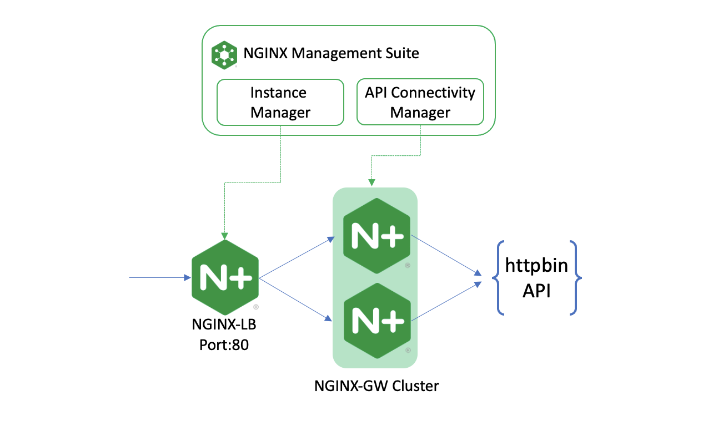

## Prerequisite: 
- Install docker and docker-compose in your machine
- In [NGINX website](https://www.nginx.com/pricing/) request for NGINX Plus and NGINX Management Suite trial licenses


## Getting started
0. **Access Lab Environment
After starting NGINX Workshop Sandpit blueprint, access vscode app via Ubuntu->vscode
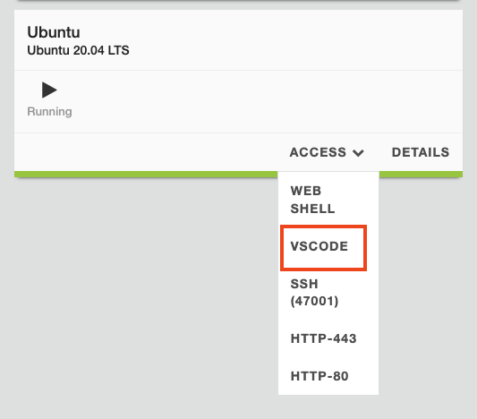

Access the terminal in VSCode
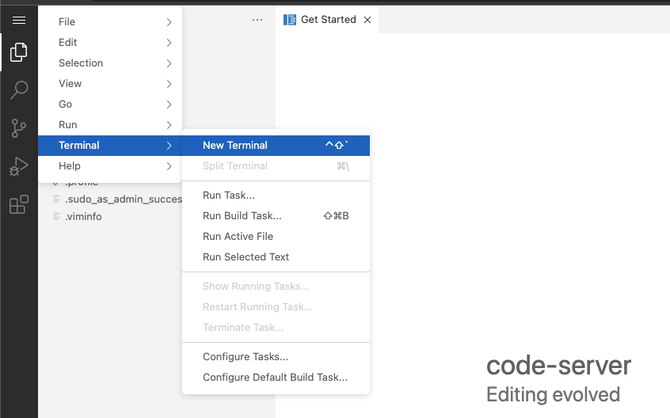


1. **Start NMS**
```
#Clone the repo
git clone https://github.com/mcheo-nginx/nms-demo-kit

cd nms-demo-kit

#Make the script executable
chmod 755 -R ./scripts/

#Download NGINX Plus trial license and put nginx-repo.crt and nginx-repo.key in nginx-plus folder
cp nginx-repo.* nginx-plus/

#Build NMS (NGINX Instance Manager, API Connectivity Manager) container image
#Example build with the latest release
sudo ./scripts/buildNMS.sh -t nginx-nms -i -C nginx-plus/nginx-repo.crt -K nginx-plus/nginx-repo.key -A -W

#Or build with specific version
#You may edit Dockerfile to specify the .deb package version for the required modules
#sudo ./scripts/buildNMS.sh -t nginx-nms:2.6 -C nginx-plus/nginx-repo.crt -K nginx-plus/nginx-repo.key -A -W

#To deploy NMS container
#Running in MacOS might encounter port 5000 being used by AirPlay sharing process. 
#You may change the port to other than 5000 in docker-compose.yaml eg: - "6000:5000"

sudo docker compose -f docker-compose.yaml up -d
```

2. **Access NMS GUI**

After few momemnt, click on Ubuntu -> HTTP-443 to access the NMS. login with admin/admin credentials or whatever you specify in the docker-compose.yaml

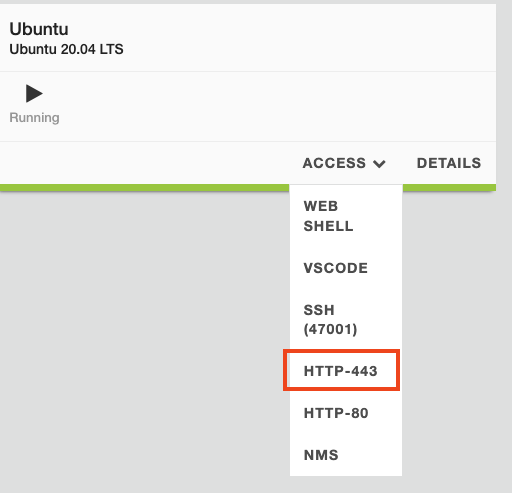
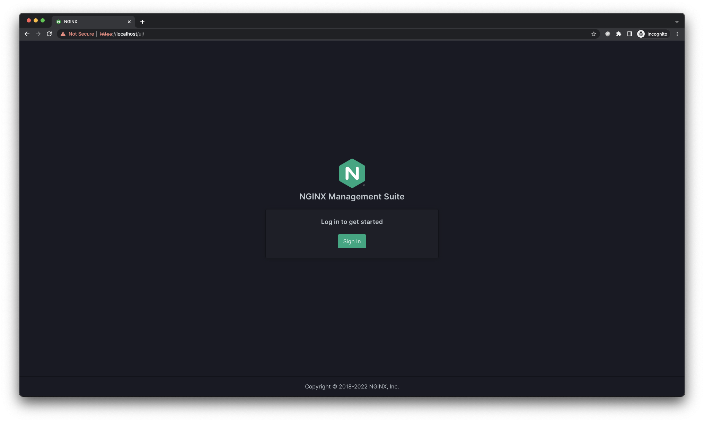
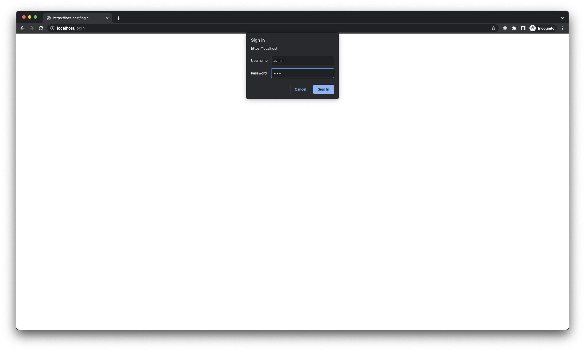


Click on Settings and upload the NMS trial license.
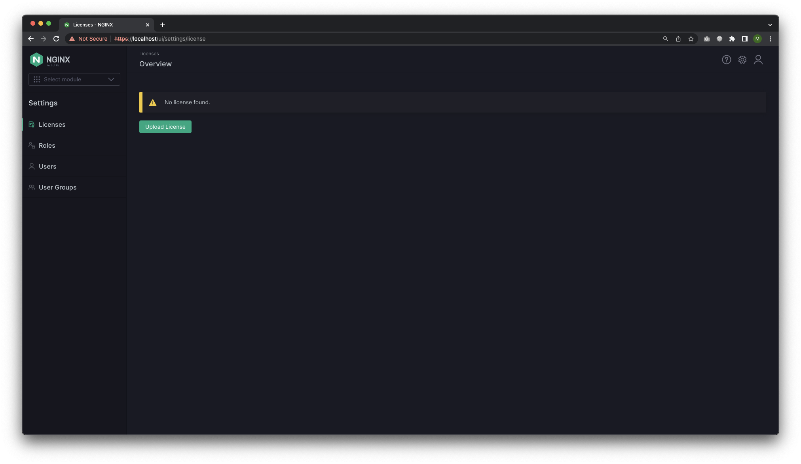

Click on the browser Refresh button for the page to display availalble modules.

3. **Start NGINX Plus**
```
#Build NGINX Plus image with nginx-agent
#Specify NMS IP address (your laptop IP address), DO NOT use localhost or 127.0.0.1
sudo ./scripts/buildNPlusWithAgent.sh -t npluswithagent -n https://10.1.1.6

#Uncomment nginx-lb, nginx-gw, httpbin-app section in docker-compose.yaml section
sudo docker compose -f docker-compose.yaml up -d
```
You should have these number of containers running
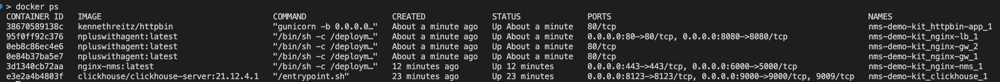

For the first time, click browser refresh. On NMS Instance Manager dashboard, you should see these instances
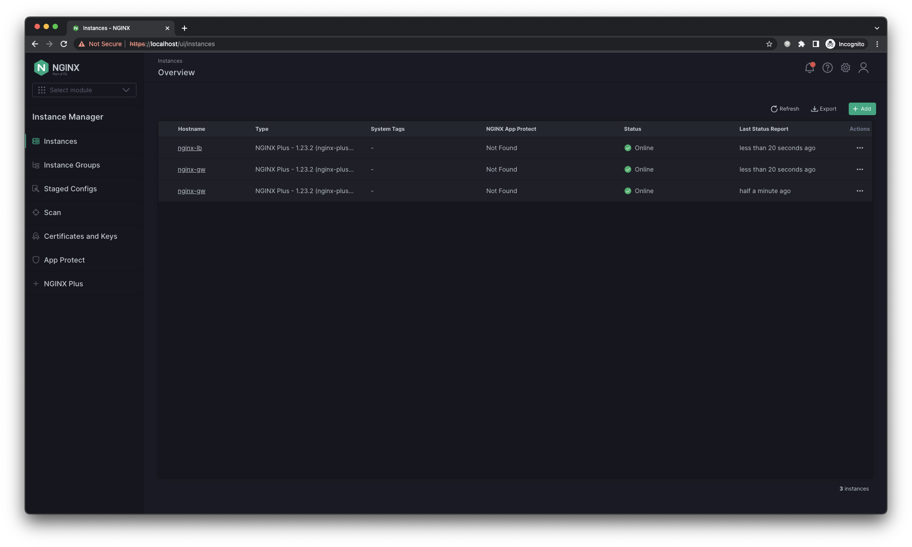


4. **Configure Load Balancer using NIM**

Enable NGINX API for NGINX LB

- In Instance Manager section, Instances tab, click on nginx-lb and Edit Config, add a new file as /etc/nginx/conf.d/nplusapi.conf  You may copy the content from repo misc/nplusapi.conf
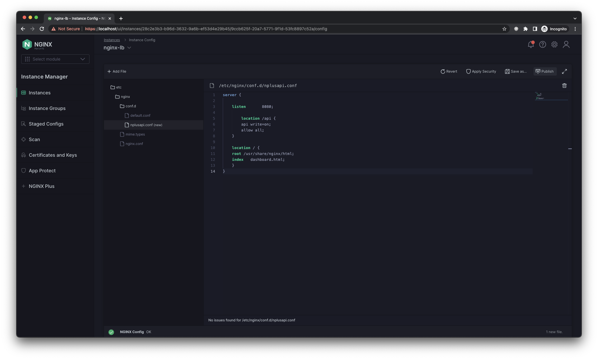

- Replace the existing default.conf config with misc/lb.conf config
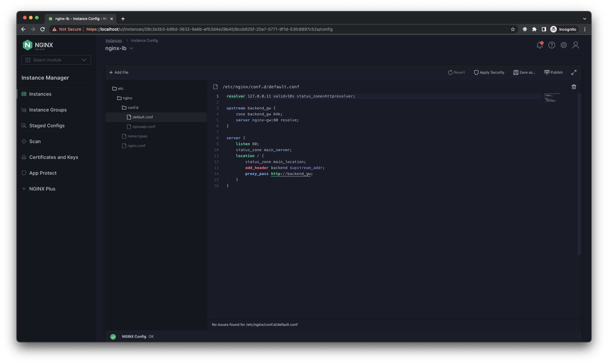

- Click Publish

Test the LB setting
```
curl -I http://localhost/
curl -I http://localhost/
```
We have configured NGINX load balancer to return backend server's IP address. There are multiple backend server (NGINX Gateway), the NGINX load balancer will round robin to different backend server and return respective IP addresses. Your containers IP addresses might be different from what is shown below.

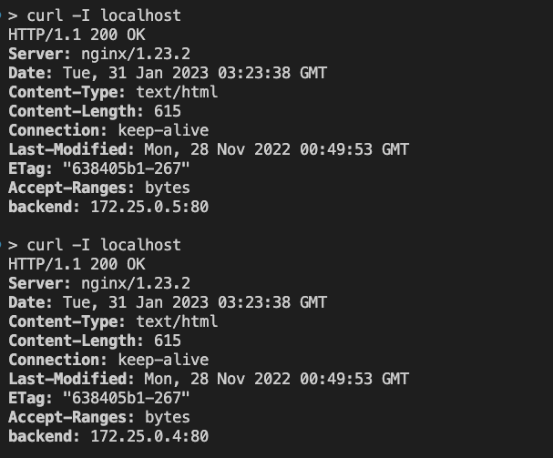


5. **Configure API Gateway using ACM**

Tips: For step 5, you may choose to use the script to automate ACM configuration. However, you are encouraged to manually execute the steps below to be familiar with the ACM workflow.
```
#sh misc/end2end_deploy.sh
#sh misc/end2end_delete.sh
```

Enable API Gateway Cluster

- In API Connectivity Manager, Infrastructure, create a Workspace, an Environment. In the Environment tab, add API Gateway Cluster. You may fill in any mock details, but the Name of the API Gateway Clusters must be same with the instance group name you specify for the nginx-gw in docker-compose file, in this case "gwcluster"

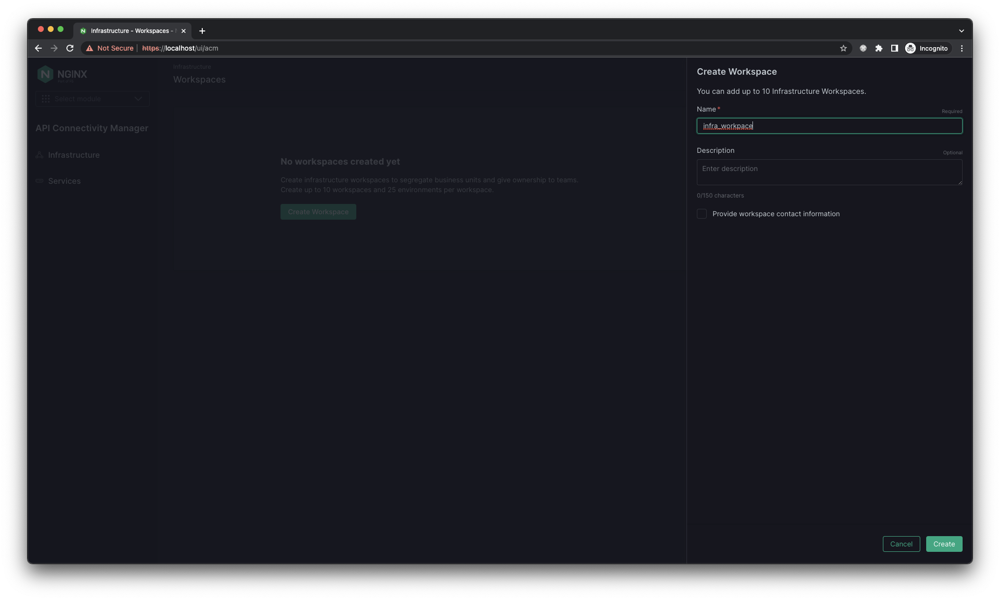
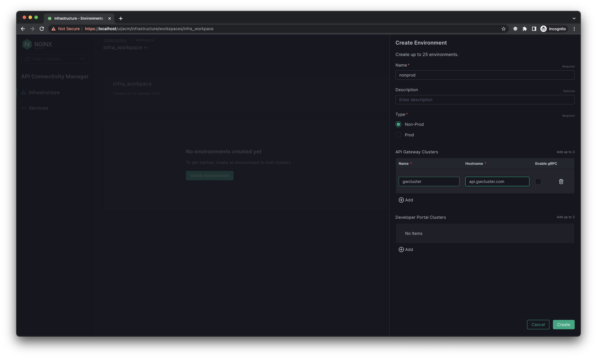

- Once done, click into the API Gateway section, you will see there are 2 nginx-gw in the Instances section.
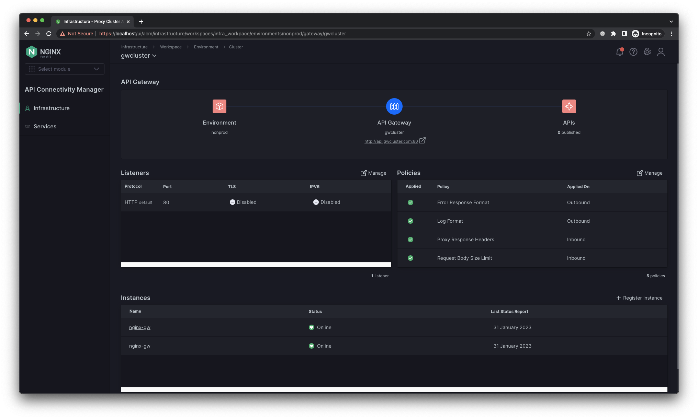

Optional:
By scaling the nginx-gw instances, the newly spin up instance will auto register as part of the API Gateway Cluster instance group. You will notice additional instance in the Instances section.
```
# Edit docker-compose file, under nginx-gw section, change the replicas to 3
docker-compose -f docker-compose.yaml up -d
```

- Under API Connectivity Manager, Services, create a Workspace, Publish API Proxy
```    
Name: <anything>
Service Target Hostname: httpbin-app
Use an OpenAPI spec: Yes
Upload repo misc/httpbin-oas.yaml
Gateway Proxy Hostname: Select the gateway proxy that you have created
```

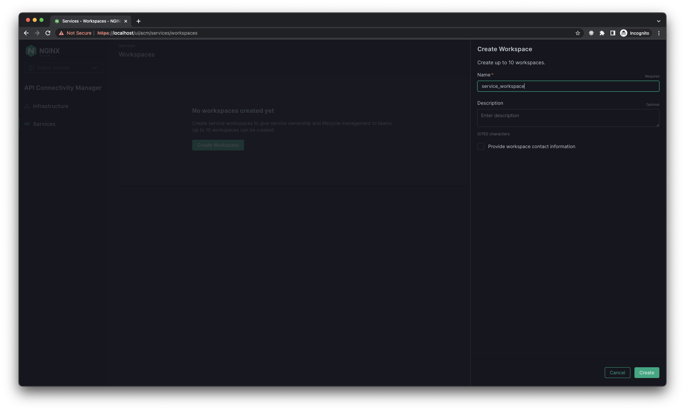

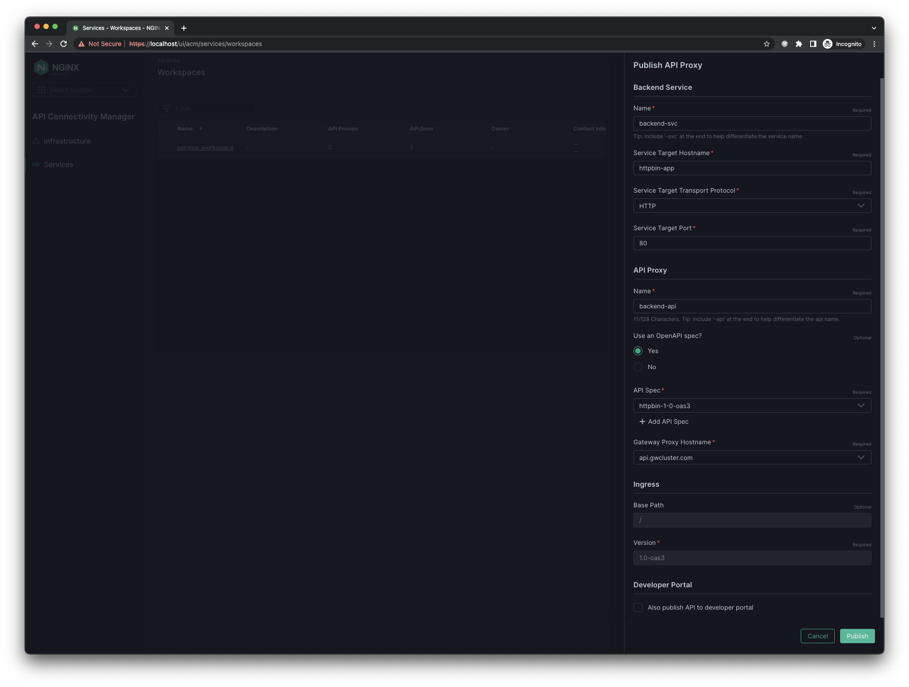


- In Advanced Configuration, inisde Ingress section change the following fields and then Click Save and Publish
```
Append Rule: None
Strip Base Path and Version before proxying the request: Yes
```
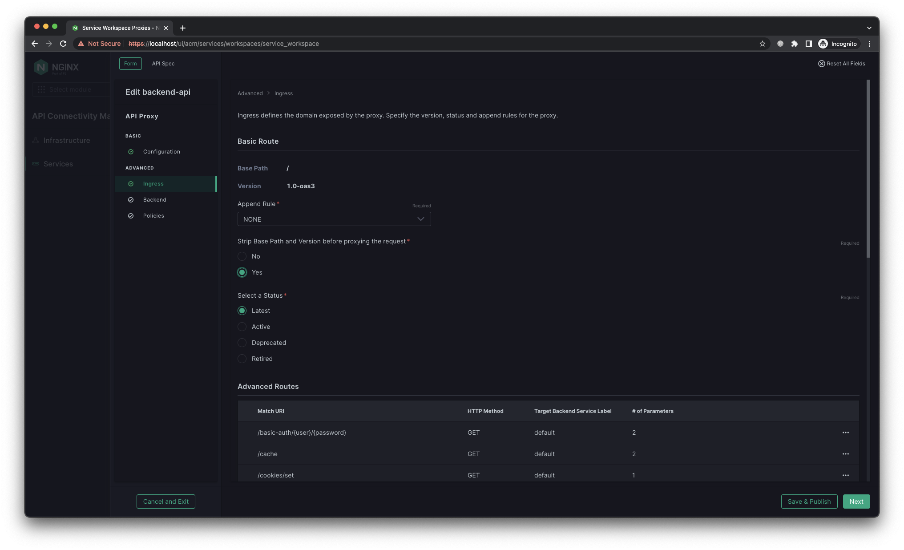


Test the ACM setting
```
#You may refer to the misc/httpbin-oas.yml for other possible httpbin endpoints
curl -v localhost/get
curl -v localhost/headers
```

You may try to configure different policies in ACM and see how it work.

## Bonus
Instead of using NGINX Plus as LB, you may use NGINX App Protect (NAP) as LB + WAF to protect the API endpoints.
At the time of this writing, it is possible to manage NAP policies via NMS in VM setup but not in docker container. Hence, we will just manually create NAP policies in NGINX NAP instance and then manage the nginx.conf via NMS.

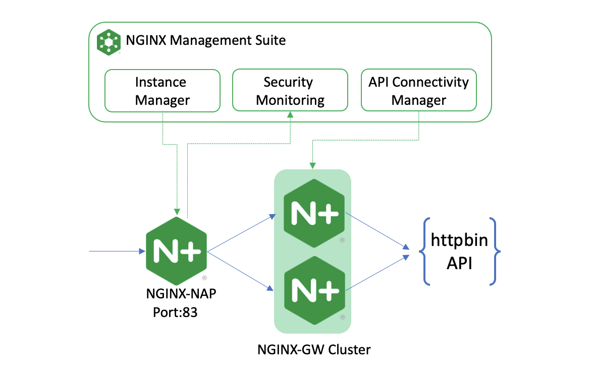

```
#Build NGINX App Protect image with nginx-agent
#Specify NMS IP address (your laptop IP address), DO NOT use localhost or 127.0.0.1
sudo ./scripts/buildNAPWithAgent.sh -t napwithagent -n https://10.1.1.6

#Uncomment nginx-nap section in docker-compose.yaml section
sudo docker compose -f docker-compose.yaml up -d
```
NGINX NAP takes slightly more time to start up, wait for it.

Configure NAP in Instance Manager

- In Instance Manager section, Instances tab, click on nginx-nap and Edit Config, replace nginx.conf with repo misc/nap_lb.conf
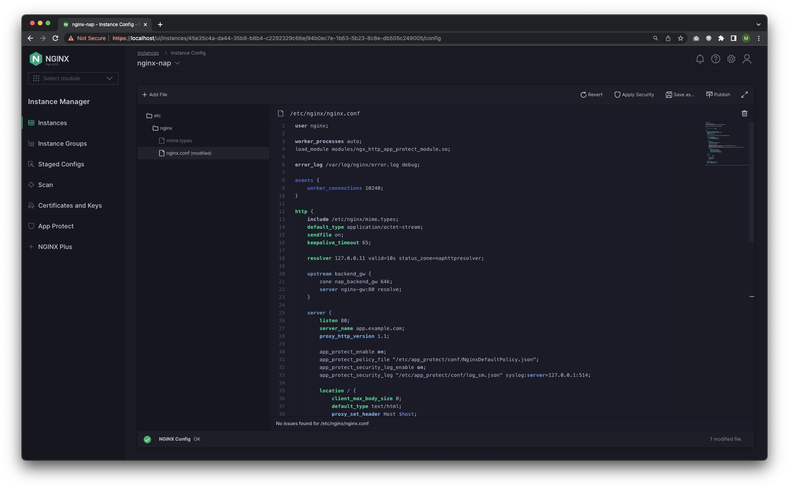

- Click Publish

```
#Send traffic to NAP
curl localhost:83/get

#Violation
curl "localhost:83/get?<script>"
curl "localhost:83/get?username=1'%20or%20'1'%20=%20'1'))%20LIMIT%201/*&amp;password=foo"
```

After generating some violations, head over to NMS Security Monitoring dashboard to view the report.
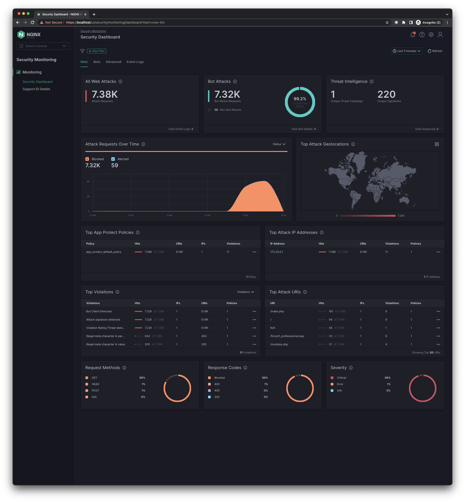

